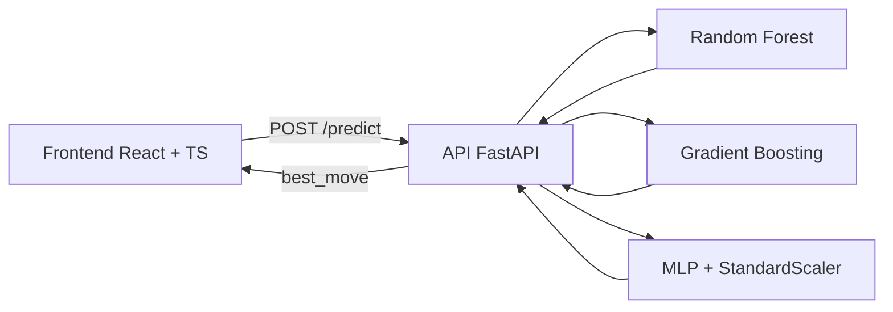

# Tic Tac Toe con Inteligencia Artificial

Proyecto academico de Tres en Raya (Tic Tac Toe) con:
- Frontend web en React + TypeScript
- Backend en FastAPI
- Tres modelos de Machine Learning para sugerir la mejor jugada

Este repositorio combina desarrollo web y aprendizaje automatico para jugar contra distintas IA y comparar su comportamiento.

## Tabla de contenido

- [Vista general](#vista-general)
- [Arquitectura del proyecto](#arquitectura-del-proyecto)
- [Algoritmos de aprendizaje automatico](#algoritmos-de-aprendizaje-automatico)
- [Estructura del repositorio](#estructura-del-repositorio)
- [Requisitos](#requisitos)
- [Instalacion y ejecucion](#instalacion-y-ejecucion)
- [Entrenamiento de modelos](#entrenamiento-de-modelos)
- [Uso de la API](#uso-de-la-api)
- [Detalles tecnicos interesantes](#detalles-tecnicos-interesantes)
- [Mejoras futuras](#mejoras-futuras)

## Vista general

La aplicacion permite seleccionar modo de juego:
- Player 1 vs Player 2 (humano vs humano)
- IA con Random Forest
- IA con Gradient Boosting
- IA con Red Neuronal Multicapa (MLP)

Cuando juegas contra IA, el frontend envia el estado actual del tablero al backend, y este responde con la posicion recomendada (indice de 0 a 8).

## Arquitectura del proyecto



## Algoritmos de aprendizaje automatico

Los modelos se entrenan para predecir la mejor jugada segun:
- 9 posiciones del tablero
- turno actual del jugador

Total de caracteristicas de entrada: 10.

### 1) Random Forest
- Tipo: ensamble de arboles de decision
- Implementacion: `RandomForestClassifier`
- Hiperparametros definidos:
  - `n_estimators=200`
  - `max_depth=10`
  - `random_state=42`

### 2) Gradient Boosting
- Tipo: ensamble secuencial de arboles debiles
- Implementacion: `GradientBoostingClassifier`
- Hiperparametros definidos:
  - `n_estimators=150`
  - `max_depth=3`
  - `random_state=42`

### 3) Red Neuronal Multicapa (MLP)
- Tipo: red neuronal feed-forward
- Implementacion: `MLPClassifier`
- Hiperparametros definidos:
  - `hidden_layer_sizes=(128, 64)`
  - `activation="relu"`
  - `max_iter=1000`
  - `random_state=42`
- Nota: este modelo requiere escalado de datos con `StandardScaler` antes de predecir.

## Estructura del repositorio

```text
backend/
  tic_tac_toe_api/
    main.py
    train_models.py
    requirements.txt
    models/

documentacion/
  Gradient_Boosting.ipynb
  Random_Forestpynb.ipynb
  Red_Neuronal_(MLP)_(Blindado).ipynb

frontend/
  Tres_en_Raya/
    src/
    package.json
```

## Requisitos

### Backend
- Python 3.10 o superior
- pip

### Frontend
- Node.js 18 o superior
- npm

## Instalacion y ejecucion

### 1) Clonar repositorio

```bash
git clone <URL_DEL_REPO>
cd "tarea final"
```

### 2) Levantar backend (FastAPI)

En una terminal:

```bash
cd backend/tic_tac_toe_api
python -m venv .venv
```

Activar entorno virtual:

Windows (PowerShell):
```powershell
.\.venv\Scripts\Activate.ps1
```

Windows (CMD):
```bat
.venv\Scripts\activate.bat
```

Linux/Mac:
```bash
source .venv/bin/activate
```

Instalar dependencias:

```bash
pip install -r requirements.txt
```

Entrenar modelos (solo primera vez o cuando quieras reentrenar):

```bash
python train_models.py
```

Iniciar API:

```bash
uvicorn main:app --reload
```

API disponible en:
- http://127.0.0.1:8000
- Documentacion interactiva: http://127.0.0.1:8000/docs

### 3) Levantar frontend (React + Vite)

En otra terminal:

```bash
cd frontend/Tres_en_Raya
npm install
npm run dev
```

Abrir en navegador la URL que indique Vite (normalmente http://localhost:5173).

## Entrenamiento de modelos

El script `train_models.py`:
1. Descarga un dataset CSV desde GitHub.
2. Limpia y transforma los datos del tablero:
   - X -> 1
   - O -> -1
   - _ o b -> 0
3. Convierte turno actual:
   - X -> 1
   - O -> -1
4. Divide datos en train/test.
5. Entrena los 3 modelos.
6. Guarda artefactos en `backend/tic_tac_toe_api/models/`:
   - `random_forest.pkl`
   - `gradient_boosting.pkl`
   - `mlp.pkl`
   - `scaler_mlp.pkl`

## Uso de la API

Endpoint principal:
- Metodo: POST
- Ruta: `/predict`

Body esperado:

```json
{
  "board": ["X", "_", "O", "_", "X", "_", "_", "O", "_"],
  "turn": "X",
  "ai": 1
}
```

Donde:
- `board`: lista de 9 elementos
- `turn`: `"X"` o `"O"`
- `ai`:
  - `1` -> Random Forest
  - `2` -> Gradient Boosting
  - `3` -> MLP

Respuesta:

```json
{
  "best_move": 2
}
```

`best_move` representa una casilla entre 0 y 8 con este mapeo:

```text
0 | 1 | 2
3 | 4 | 5
6 | 7 | 8
```

## Detalles tecnicos interesantes

- El frontend permite cambiar de IA en tiempo real desde el selector de modo de juego.
- El backend carga los modelos al iniciar, para reducir latencia en cada prediccion.
- El modelo MLP usa su propio `scaler` guardado para asegurar consistencia entre entrenamiento e inferencia.
- Se incluye carpeta `documentacion/` con notebooks de experimentacion y matrices de confusion por modelo.
- CORS esta habilitado para facilitar pruebas locales entre frontend y backend.

## Mejoras futuras

- Evaluacion comparativa de precision y tiempo de inferencia por modelo.
- Contenerizacion con Docker para despliegue reproducible.
- Selector de dificultad basado en estrategias hibridas (reglas + ML).
- Persistencia de historial de partidas y estadisticas.
